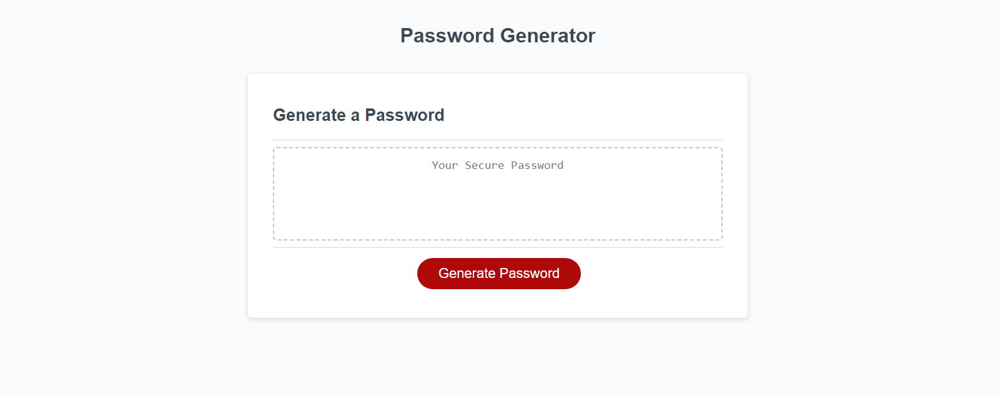
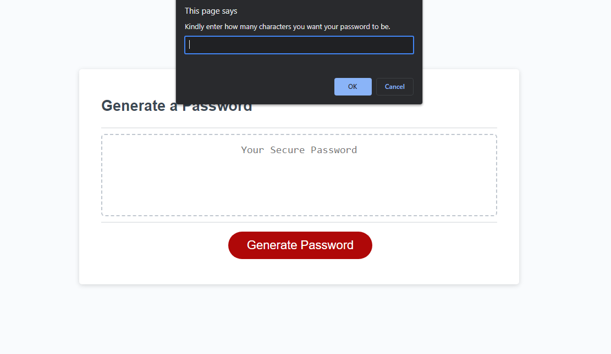
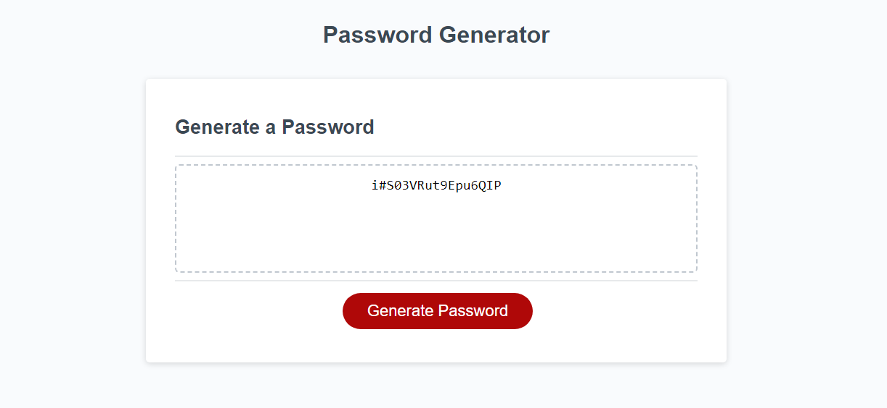

# Password-Generator

## Description

This is a secure password generator that will generate a password between 8-128 characters long. The generator will prompt intake from user on button click to input wanted length of password. If number is not inbetween 8-128 use will be alerted to try again.

Once an accepted value has been entered user will go through a series of confirms asking if they want to include characters from the following categories:

Upper Case Letters

Lower Case Letters

Numbers

Special Characters

After confirming selections the user will have a password generated. If no character class were confirmed user will be prompted to select at least one selection and function will return back to start of confirms.

This is a great project to practice writing JavaScript and to understand the logic behind functions. 

## Display

Below are some images of how website functions.

## Installation

N/A

## Usage

[Visit the Page Here.](https://rdheadyii.github.io/Password-Generator/)

## Credits

N/A

## License

N/A